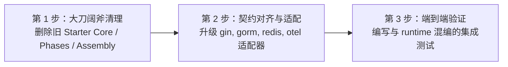

# gochen-contrib 重构方案与实施指南

本文档为 `gochen-contrib` 仓库的下一代架构重构提供权威指引，明确其在新一代 Gochen（`gochen` + `gochen-runtime`）体系下的全新定位、清理清单、技术栈插件化规范及迁移步骤。

---

## 1. 定位重塑与核心原则

### 1.1 架构分工再明确

在新一代 Gochen（`gochen` + `gochen-runtime`）体系下，三层架构定位如下：

```
┌──────────────────────────────────────────────────────────────┐
│                    1. gochen (Core 契约)                     │
│    领域建模、用例编排、事件溯源、消息总线、分层权限抽象 (零重依赖)     │
└──────────────────────────────┬───────────────────────────────┘
                               │
         ┌─────────────────────┴─────────────────────┐
         ▼                                           ▼
┌──────────────────────────────┐            ┌──────────────────────────────┐
│ 2. gochen-runtime (标准运行时)│            │  3. gochen-contrib (生态插件) │
│ - 官方默认、一等公民生产运行时  │            │ - 第三方重依赖外设扩展包     │
│ - 纯 Go 标准库打造 (Zero Bloat)│            │ - 满足非标准库技术栈选型需求 │
│ - host, nethttp, lite/repo   │            │ - gin, gorm, redis, otel     │
└──────────────────────────────┘            └──────────────────────────────┘
```

- **`gochen-runtime`** 已经内置了完整的标准生产闭环（`host` 模块容器、`net/http` 服务、`lite + repo` 数据库持久化、`migrate` 迁移、`sql` 锁、内置监控）；
- **`gochen-contrib` 的职责彻底转变为：专注于为必须依赖特定第三方开源生态的项目提供可插拔的“外设驱动/适配器”**。

### 1.2 核心设计原则

1. **废除 Starter 自研启动器**：Starter 不再提供 `starter.New(...)` 或基于 Phase 状态机的启动入口，所有生命周期统一交给 `gochen-runtime/host`；
2. **纯粹的驱动插件**：每个第三方适配器只负责实现 `gochen` / `gochen-runtime` 对应的接口（如 `httpx.IServer`、`orm.IOrm`、`lock.ILockProvider`）；
3. **依赖隔离与防污染**：避免在一个大 `go.mod` 中同时强绑定 Gin、GORM、Redis、Prometheus、OTel，应支持按需引入；
4. **全面对齐 Next 规范**：严格遵循单向依赖，全面使用 Next 的统一错误码、上下文透传与最新基础包。

---

## 2. 废除与清理清单

重构时应首先从 `gochen-contrib` 中**彻底删除**以下陈旧代码：

| 待清理路径/文件 | 原功能 | 废除理由与替代方案 |
| :--- | :--- | :--- |
| `starter.go`, `phases.go`, `builder.go`, `managed.go`, `state.go`, `registry.go` | 旧版 Starter Core 启动状态机 | **彻底废弃**。全面替换为 `gochen-runtime/host` 的 `host.Run` 与 `host.Module`。 |
| `assembly/` | 启动期消息总线与监控装配辅助 | **彻底废弃**。由 `gochen-runtime/host/config` 的 `hostconfig.WithXxx` 原生支持。 |
| `di/container/` | 旧反射 DI 容器 | **彻底废弃**。统一使用 `gochen-runtime/di`。 |
| `migration/` | 旧数据库迁移包装 | **彻底废弃**。统一使用 `gochen-runtime/db/migrate`。 |
| `http/monitoring/` | 独立监控路由 | **彻底废弃**。由 `gochen-runtime/eventing/monitoring` 与 Host 原生集成。 |
| `http/introspect/` | 路由自省 | **废弃或收敛**至 Gin 适配器内部。 |

---

## 3. 技术栈插件化重构规范

清理完成后，`gochen-contrib` 将转型为纯粹的 **生态适配插件集**：

```
gochen-contrib/
├── http/
│   └── gin/           # Gin 适配器 (实现 gochen/httpx.IServer)
├── data/
│   └── orm/gorm/      # GORM 适配器 (实现 gochen/db/orm.IOrm 与 db.IDatabase)
├── lock/
│   └── redis/         # Redis 分布式锁驱动 (实现 gochen/process/lock.ILockProvider)
└── observe/
    ├── otel/          # OpenTelemetry 追踪物理导出适配器
    └── prometheus/    # Prometheus Client 物理指标采集适配器
```

### 3.1 Gin 适配器重构 (`http/gin`)
- **目标契约**：实现 `gochen/httpx.IServer` 接口；
- **注入方式**：提供便捷的 Host 选项或构造函数：
  ```go
  // 下游装配方式
  server, err := gogin.New(cfg)
  host.Run(ctx,
      hostconfig.WithHTTPServer(server),
      // ...
  )
  ```
- **关键对齐**：
  - 路由上下文必须与 `gochen/contextx` 的 TraceID、TenantID、Operator 严格对齐；
  - 错误响应走 `gochen/errors.Normalize` 映射；
  - 移除对旧版 `gochen/auth/http` 的依赖，动作拦截走 `gochen-runtime/api/rest/action.FastDeny`。

### 3.2 GORM 适配器重构 (`data/orm/gorm`)
- **目标契约**：实现 `gochen/db/orm.IOrm`、`orm.IModel` 与 `db.IDatabase`；
- **注入方式**：
  ```go
  gormDB, err := gorm.Open(...)
  ormAdapter, err := gormorm.New(gormDB)
  // 注入到通用 repo 或 DI 容器
  repo, err := ormrepo.NewRepo[*Order, int64](ormAdapter, "orders", ...)
  ```
- **关键对齐**：
  - `IModel.Dialect()` 必须根据 `db.Dialector.Name()` 返回准确的 `dialect.IDialect`（支持 MySQL, Postgres, SQLite）；
  - `QueryOptions` 正确映射到 GORM 的 `Where`, `Joins`, `Order`, `Group`, `Limit`, `Offset`, `Clauses(clause.Locking{...})`；
  - 事务 `BeginTx` 必须返回绑定了 `contextx.IAfterCommitDispatcher` 的 `orm.IOrmSession`。

### 3.3 Redis 分布式锁重构 (`lock/redis`)
- **目标契约**：实现 `gochen/process/lock.ILockProvider` 接口；
- **关键对齐**：
  - 构造函数显式接收 `redis.UniversalClient` 与 `*redislock.Config`；
  - 日志记录统一使用 `gochen/observe/logging.ILogger`；
  - 保持基于随机 Token + Lua 脚本的安全释放与原子超时控制。

### 3.4 可观测性适配器 (`observe/otel` & `observe/prometheus`)
- **目标契约**：实现 `gochen/observe` 与 `gochen/eventing/monitoring` 相关导出接口；
- **关键对齐**：从 `contextx` 提取分布式链路上下文，打通 OpenTelemetry Tracer 与 Prometheus Metrics。

---

## 4. 依赖升级与包名迁移对照表

重构 `gochen-contrib` 时，必须将所有的旧包引用全部替换为新一代 Gochen 的最新包名：

| 旧版引用 (Old GoChen) | 最新引用 (GoChen Next) | 说明 |
| :--- | :--- | :--- |
| `gochen/ident` | `gochen/gen` | ID 生成器契约统一在 `gen`（`snowflake`, `uuid` 等） |
| `gochen/logging` | `gochen/observe/logging` | 日志接口与标准实现统一收拢 |
| `gochen/auth` (根包) | `gochen/auth/action`<br>`gochen/auth/scoped`<br>`gochen/auth/governance` | 权限分层契约拆分 |
| `gochen/domain/access` | `gochen/auth/scoped` | 范围授权与写约束标准包 |
| `gochen/db/naming` | `gochen/codec/casecodec` | 命名风格转换统一为 `Words` 规范中间表示 |
| `gochen/host/config` | `gochen-runtime/host/config` | Host 配置迁移至 Runtime |
| `gochen/host/module` | `gochen-runtime/host/module` | Host 模块抽象迁移至 Runtime |

---

## 5. 重构实施路线图（三步走）



1. **第 1 步：清理冗余（Delete Phase）**：
   - 彻底删除 `starter.go`, `phases.go`, `builder.go`, `managed.go`, `state.go`, `assembly/`, `di/container/`, `migration/`；
   - 将 `go.mod` 指向最新的 `gochen` 与 `gochen-runtime`。
2. **第 2 步：适配器升级（Refactor Phase）**：
   - 逐个重构 `http/gin`、`data/orm/gorm`、`lock/redis`、`observe/otel`、`observe/prometheus`；
   - 更新所有 imports 与 API 签名，确保编译通过。
3. **第 3 步：集成验证（Verification Phase）**：
   - 编写单元测试与集成测试，验证 `gogin.Server` 与 `gormorm.Orm` 可以无缝作为组件注入到 `host.Run` 和 `ormrepo.NewRepo` 中运行。
